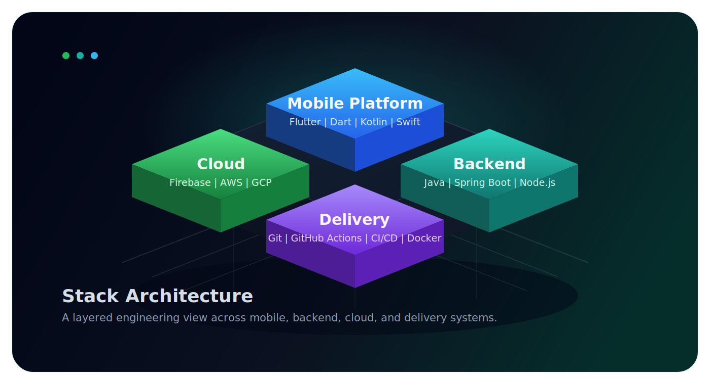

<div align="center">
  
</div>

<div align="center">

### Designing clean mobile systems, reliable backends, and product-focused user experiences

[](https://github.com/EdderGaddini)
[](https://linkedin.com/in/eddergaddini)
[](mailto:egaddini.dev@gmail.com)

</div>

<p align="center">
  I build production software with strong architecture, practical delivery, and attention to the user experience from mobile app to backend integration.
</p>

## Profile

<table>
  <tr>
    <td width="52%" valign="top">

### What I Bring

- 6+ years building software for real users
- Strongest in Flutter, Dart, mobile architecture, and product delivery
- Comfortable across Java, Spring Boot, Firebase, JavaScript, cloud services, and CI/CD
- Prefer clean architecture, clear ownership, and maintainable systems over noisy complexity

    </td>
    <td width="48%" valign="top">

### Current Focus

```text
Mobile platforms   -> scalable Flutter foundations
Backend systems    -> APIs, Firebase, Spring Boot
Delivery quality   -> CI/CD, maintainability, iteration speed
User value         -> features that feel polished in production
```

    </td>
  </tr>
</table>

## 3D Stack Architecture

<div align="center">
  
</div>

<div align="center">
  
</div>

## Engineering Themes

<table>
  <tr>
    <td valign="top">
      <strong>Mobile</strong><br/>
      Flutter, Dart, app architecture, performance, maintainable UI systems
    </td>
    <td valign="top">
      <strong>Backend</strong><br/>
      Java, Spring Boot, Node.js, integrations, service design
    </td>
    <td valign="top">
      <strong>Cloud</strong><br/>
      Firebase, AWS, GCP, deployment flow, automation
    </td>
  </tr>
</table>

## Selected Repositories

- [EdderGaddini.github.io](https://github.com/EdderGaddini/EdderGaddini.github.io) - portfolio site and presentation experiments
- [bikers-pathway](https://github.com/EdderGaddini/bikers-pathway) - route and product-oriented exploration
- [bikers-wayfinder](https://github.com/EdderGaddini/bikers-wayfinder) - navigation-focused work in active iteration

## GitHub Snapshot

<div align="center">
  
  
</div>

<div align="center">
  
</div>

## GitHub Tier Ranking

<div align="center">
  
  
  
</div>

<div align="center">

| Metric | Value |
|--------|-------|
| Total Commits | 44 |
| Stars Received | 0 |
| Public Repositories | 13 |
| Followers | 0 |

</div>

## Contribution Activity

<div align="center">
  
</div>

<div align="center">
  <sub>Open to building mobile products, platform improvements, and full-stack features with clear product impact.</sub>
</div>
